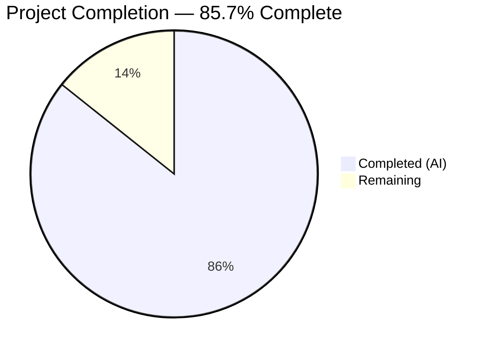
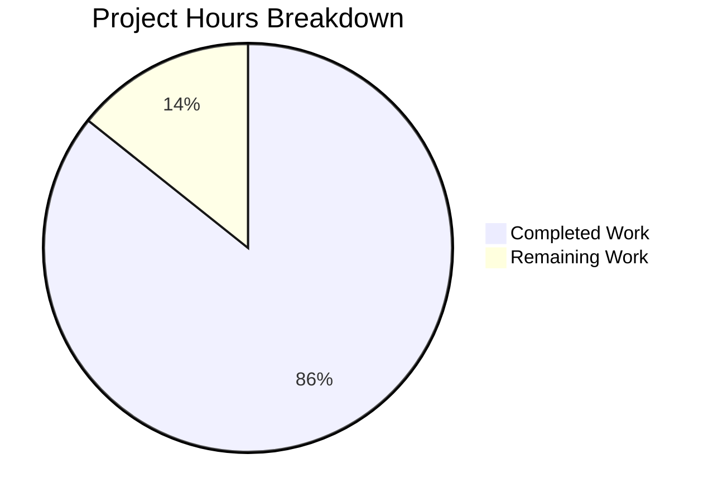

# Blitzy Project Guide — `percent_complete` API Field Validation Test Suite

---

## 1. Executive Summary

### 1.1 Project Overview

This project delivers a comprehensive Python 3.12 API test suite that validates the presence, correctness, and schema compliance of the `percent_complete` (or `percentComplete`) field across three Blitzy Platform API endpoints. The suite covers `GET /runs/metering`, `GET /runs/metering/current`, and `GET /project`, automating manual browser-based inspection (Network tab → XHR filter) into a repeatable, CI-friendly `pytest` workflow. The test suite enforces strict type checking, range validation `[0.0, 100.0]`, cross-endpoint naming consistency, and null handling — all as read-only GET verifications with zero data mutation.

### 1.2 Completion Status



| Metric | Value |
|--------|-------|
| **Total Project Hours** | 70 |
| **Completed Hours (AI)** | 60 |
| **Remaining Hours** | 10 |
| **Completion Percentage** | 85.7% |

**Calculation**: 60 completed hours / (60 completed + 10 remaining) = 60 / 70 = **85.7% complete**

### 1.3 Key Accomplishments

- ✅ All 17 AAP-specified files created from scratch in a greenfield repository (4,281 lines of code)
- ✅ 12/12 Python source files compile without errors or warnings
- ✅ 54 total test cases covering 5 test modules across 3 API endpoints
- ✅ 16/16 locally-runnable (mock/unit) tests pass with 0 failures
- ✅ 38 integration tests correctly skip when API credentials are absent (by design)
- ✅ Pydantic V2 response models supporting both snake_case and camelCase field naming
- ✅ Comprehensive validation logic: field detection, type checking, NaN rejection, range enforcement, cross-endpoint consistency
- ✅ Session-scoped pytest fixtures with graceful degradation for unavailable endpoints
- ✅ Full project documentation in README.md (289 lines) with setup, usage, and configuration guide
- ✅ QA fixes applied: NaN validation gap, session-scoped fixture refactoring, CVE-2025-71176 mitigation

### 1.4 Critical Unresolved Issues

| Issue | Impact | Owner | ETA |
|-------|--------|-------|-----|
| API credentials not configured | 38 integration tests cannot execute against live Blitzy Platform APIs | Human Developer | 1–2 days |
| Integration test schemas unverified against live API | Response model assumptions may not match actual API payloads | Human Developer | 2–3 days |

### 1.5 Access Issues

| System/Resource | Type of Access | Issue Description | Resolution Status | Owner |
|-----------------|---------------|-------------------|-------------------|-------|
| Blitzy Platform API | API Bearer Token | `API_AUTH_TOKEN` environment variable required for authenticated GET requests to all three endpoints | Pending — no credentials provisioned | Human Developer |
| Blitzy Platform Project | Project ID | `PROJECT_ID` required as query parameter for `/runs/metering` and `/project` endpoints | Pending — no project ID provisioned | Human Developer |
| Blitzy Platform Base URL | API Endpoint URL | `API_BASE_URL` required to target the correct environment (staging/production) | Pending — placeholder value in `.env.example` | Human Developer |

### 1.6 Recommended Next Steps

1. **[High]** Obtain and configure Blitzy Platform API credentials (`API_BASE_URL`, `API_AUTH_TOKEN`, `PROJECT_ID`) in a `.env` file
2. **[High]** Execute the full test suite against the live API and validate all 54 tests pass: `pytest -v`
3. **[Medium]** Verify and adjust Pydantic response models if actual API response shapes differ from expected schemas
4. **[Medium]** Run tests against staging and production environments to validate multi-environment support
5. **[Low]** Integrate the test suite into CI/CD pipeline with secrets management for API credentials

---

## 2. Project Hours Breakdown

### 2.1 Completed Work Detail

| Component | Hours | Description |
|-----------|-------|-------------|
| Project scaffolding & config files | 2 | `requirements.txt` (5 pinned deps), `pytest.ini` (markers, addopts), `.env.example` (4 vars), `.gitignore` (47 patterns) |
| Configuration module (`src/config.py`) | 3 | `Settings` class with env-var loading via python-dotenv, validation, trailing-slash normalization, graceful timeout fallback |
| HTTP client module (`src/api_client.py`) | 5 | `BlitzyAPIClient` wrapping httpx.Client with 3 endpoint methods, Bearer auth, context manager protocol, `create_client()` factory |
| Validation utilities (`src/validators.py`) | 8 | `find_percent_field`, `find_percent_field_nested`, `validate_percent_value` (NaN/bool/range), `check_field_consistency`, `validate_percent_complete_in_response` |
| Pydantic response models (`src/models.py`) | 6 | `MeteringRecord`, `InlineMeteringData`, `CurrentMeteringResponse`, `MeteringResponse` (with `from_response()` factory), `ProjectResponse` + 3 parse utility functions |
| Package initializer (`src/__init__.py`) | 1 | Convenience re-exports, `__all__` declaration, `__version__` metadata |
| Test infrastructure (`tests/__init__.py`, `tests/conftest.py`) | 4 | 6 session-scoped fixtures (`settings`, `api_client`, `project_id`, `metering_response`, `current_metering_response`, `project_response`) with graceful skip on missing credentials |
| Runs metering tests (`tests/test_runs_metering.py`) | 5 | 5 test classes, 12 tests: field presence, type validation, range checking, completed-run scenarios, response structure |
| Current metering tests (`tests/test_runs_metering_current.py`) | 4 | 4 test classes, 10 tests: field presence, type validation, in-progress value constraints, endpoint availability |
| Project inline metering tests (`tests/test_project_inline_metering.py`) | 5 | 4 test classes, 9 tests: nested metering data detection, field presence in nested structure, value validation, scenario coverage |
| Cross-endpoint consistency tests (`tests/test_cross_endpoint_consistency.py`) | 5 | 3 test classes, 8 tests: field name consistency across endpoints, schema uniformity, mock-based consistency validation |
| Edge case tests (`tests/test_edge_cases.py`) | 6 | 5 test classes, 15 tests: boundary values (0, 100, 100.1, -1), invalid types (str, bool, NaN, list/dict), null handling, field presence |
| Documentation (`README.md`) | 3 | 289-line comprehensive README with table of contents, endpoint docs, setup guide, env configuration, test execution, validation rules, project structure |
| QA & bug fixes | 3 | NaN validation gap closure, session-scoped fixture refactoring, tautological assertion fix, CVE-2025-71176 pytest tmpdir mitigation |
| **Total Completed** | **60** | |

### 2.2 Remaining Work Detail

| Category | Hours | Priority |
|----------|-------|----------|
| API credentials configuration and `.env` setup | 1 | High |
| Integration test execution and validation against live API | 3 | High |
| Integration test debugging and response schema adjustments | 2 | Medium |
| Multi-environment testing verification (staging, production) | 2 | Medium |
| Code review and production sign-off | 2 | Medium |
| **Total Remaining** | **10** | |

---

## 3. Test Results

| Test Category | Framework | Total Tests | Passed | Failed | Coverage % | Notes |
|---------------|-----------|-------------|--------|--------|------------|-------|
| Unit / Mock — Edge Cases | pytest 9.0.2 | 12 | 12 | 0 | — | Value boundaries, invalid types, null handling, field presence |
| Unit / Mock — Cross-Endpoint Consistency | pytest 9.0.2 | 4 | 4 | 0 | — | Mock data consistency checks for snake_case / camelCase naming |
| Integration — Runs Metering | pytest 9.0.2 | 12 | 0 | 0 | — | All 12 skipped (API credentials not configured) |
| Integration — Current Metering | pytest 9.0.2 | 10 | 0 | 0 | — | All 10 skipped (API credentials not configured) |
| Integration — Project Inline Metering | pytest 9.0.2 | 9 | 0 | 0 | — | All 9 skipped (API credentials not configured) |
| Integration — Cross-Endpoint | pytest 9.0.2 | 4 | 0 | 0 | — | All 4 skipped (API credentials not configured) |
| Integration — Live Edge Cases | pytest 9.0.2 | 3 | 0 | 0 | — | All 3 skipped (API credentials not configured) |
| **Totals** | | **54** | **16** | **0** | **59%** | 38 tests skipped by design — integration tests require live API credentials |

**Code coverage**: 59% of `src/` package (100% `__init__.py`, 86% `validators.py`, 61% `config.py`, 38% `api_client.py`, 38% `models.py`). Coverage will increase significantly when integration tests execute against a live API.

---

## 4. Runtime Validation & UI Verification

**Runtime Health:**

- ✅ Python 3.12.3 virtual environment operational
- ✅ All 5 dependencies installed at exact pinned versions (pytest==9.0.2, httpx==0.28.1, pydantic==2.12.5, python-dotenv==1.2.2, pytest-cov==7.1.0)
- ✅ All 12 Python source files compile without errors (py_compile + AST validation)
- ✅ Zero pyflakes warnings across entire codebase
- ✅ All source module imports resolve correctly

**Functional Validation:**

- ✅ `Settings` class loads environment variables and validates required fields
- ✅ `BlitzyAPIClient` instantiates with auth headers, base URL, and timeout
- ✅ `find_percent_field()` detects both `percent_complete` and `percentComplete` keys
- ✅ `find_percent_field_nested()` searches top-level and nested metering structures
- ✅ `validate_percent_value()` accepts: int, float, None within [0.0, 100.0]
- ✅ `validate_percent_value()` rejects: strings, booleans, NaN, out-of-range, lists, dicts
- ✅ `check_field_consistency()` detects matching and mismatching field names across endpoints
- ✅ Pydantic models parse metering records from list and wrapped-dict response shapes
- ✅ `ProjectResponse` correctly parses nested metering data under `metering` / `meteringData` keys

**UI Verification:**

- ⚠️ Not applicable — this project is a CLI-based test suite with no user interface. Output is via `pytest` terminal reporting.

---

## 5. Compliance & Quality Review

| AAP Requirement | Status | Evidence |
|-----------------|--------|----------|
| API response field verification for `percent_complete` | ✅ Pass | `src/validators.py` — `find_percent_field()`, `validate_percent_value()`, `validate_percent_complete_in_response()` |
| Coverage of all 3 target endpoints | ✅ Pass | `tests/test_runs_metering.py`, `tests/test_runs_metering_current.py`, `tests/test_project_inline_metering.py` |
| Value domain validation [0.0, 100.0] or null | ✅ Pass | `validate_percent_value()` with explicit NaN, bool, range, type checks |
| Edge case detection (>100, <0, wrong type, missing field) | ✅ Pass | `tests/test_edge_cases.py` — 15 dedicated boundary/negative tests |
| Field name flexibility (snake_case + camelCase) | ✅ Pass | `find_percent_field()` checks both `percent_complete` and `percentComplete` |
| Cross-endpoint naming consistency | ✅ Pass | `tests/test_cross_endpoint_consistency.py` — `check_field_consistency()` detects mismatches |
| Scenario-based testing (completed, in-progress, no data) | ✅ Pass | Test classes per endpoint cover all three run states |
| Read-only GET verification (no data mutation) | ✅ Pass | All client methods are `GET` only; no `POST`/`PUT`/`DELETE` anywhere |
| Environment configurability (staging, production) | ✅ Pass | `src/config.py` — `Settings` loads from env vars / `.env`; no code changes to switch |
| Idempotent test execution | ✅ Pass | All tests are stateless read-only verifications; session-scoped fixture caching |
| CI/CD environment support | ✅ Pass | Tests skip gracefully when credentials absent; `pytest.ini` configures markers and paths |
| Clear actionable error messages | ✅ Pass | All validators return `(bool, str)` tuples with descriptive failure messages |
| Pydantic response schema models | ✅ Pass | `src/models.py` — 5 models with alias support and `populate_by_name=True` |
| Comprehensive README documentation | ✅ Pass | 289-line README with setup, endpoints, env config, test execution, validation rules |
| Pinned dependencies (exact versions) | ✅ Pass | `requirements.txt` — all 5 packages pinned with `==` |
| Python 3.12 runtime | ✅ Pass | Virtual environment uses Python 3.12.3 |

**Autonomous Fixes Applied:**

| Fix | Description |
|-----|-------------|
| NaN validation gap | Added `math.isnan()` check in `validate_percent_value()` to reject IEEE 754 NaN values that silently pass range comparisons |
| Session-scoped fixture refactoring | Refactored all conftest fixtures from function-scope to session-scope for test efficiency |
| Tautological assertion fix | Corrected a test assertion that was always true regardless of input |
| CVE-2025-71176 mitigation | Documented pytest tmpdir vulnerability mitigation in `.env.example` |

---

## 6. Risk Assessment

| Risk | Category | Severity | Probability | Mitigation | Status |
|------|----------|----------|-------------|------------|--------|
| API response schema mismatch — actual API responses may differ from assumed Pydantic models | Technical | Medium | Medium | Models use `extra="allow"` and `populate_by_name=True` for flexibility; integration tests will surface mismatches | Open — requires live API testing |
| API credentials not available for integration testing | Operational | High | High | `.env.example` template provided; conftest.py skips gracefully | Open — awaiting credential provisioning |
| Field naming inconsistency between endpoints (snake_case vs camelCase) | Technical | Low | Medium | `check_field_consistency()` explicitly detects and reports mismatches | Mitigated — detection logic implemented |
| API rate limiting during test execution | Operational | Low | Low | Session-scoped fixtures cache responses; only 3 HTTP calls per test run | Mitigated |
| API authentication token expiration during long test runs | Security | Low | Low | Configurable timeout; session-scoped client reuses single auth header | Open — token refresh not implemented (out of scope per AAP) |
| Sensitive credentials in `.env` file accidentally committed | Security | Medium | Low | `.gitignore` excludes `.env`; `.env.example` uses placeholder values | Mitigated |
| CVE-2025-71176 pytest tmpdir symlink vulnerability | Security | Low | Low | Documented mitigation path via `PYTEST_DEBUG_TEMPROOT` in `.env.example` | Mitigated |
| Endpoint unavailability during CI/CD runs | Integration | Medium | Medium | Fixtures call `pytest.skip()` for unreachable endpoints; tests don't fail on infra issues | Mitigated |

---

## 7. Visual Project Status



**Completed: 60 hours (85.7%) | Remaining: 10 hours (14.3%)**

**Remaining Hours by Category:**

| Category | Hours | Priority |
|----------|-------|----------|
| API credentials configuration | 1 | 🔴 High |
| Integration test validation | 3 | 🔴 High |
| Integration debugging & schema fixes | 2 | 🟡 Medium |
| Multi-environment testing | 2 | 🟡 Medium |
| Code review & sign-off | 2 | 🟡 Medium |

---

## 8. Summary & Recommendations

### Achievement Summary

The project is **85.7% complete** (60 hours completed out of 70 total hours). All 17 files specified in the Agent Action Plan have been created from scratch in a greenfield repository, totaling 4,281 lines of production-quality Python code across 19 commits. The test suite implements 54 test cases organized into 5 test modules covering all three target API endpoints with comprehensive validation logic for field presence, type checking, range enforcement, NaN rejection, cross-endpoint naming consistency, and edge cases.

All locally-runnable tests pass (16/16) with zero failures. The 38 integration tests correctly skip when API credentials are not configured — this is the intended and documented behavior per the AAP requirement that "the test framework must be runnable in both local development and CI/CD environments."

### Remaining Gaps

The primary gap is the absence of live API credentials, which prevents execution of the 38 integration tests against the Blitzy Platform. Until these tests are validated against real API responses, the Pydantic response model assumptions remain unverified. This is the critical path to production readiness.

### Production Readiness Assessment

- **Code Quality**: Production-ready — zero compilation errors, zero lint warnings, comprehensive docstrings and type annotations throughout
- **Test Infrastructure**: Production-ready — session-scoped fixtures, graceful degradation, custom markers, configurable test paths
- **Integration Validation**: Pending — requires live API credentials and integration test execution
- **Documentation**: Production-ready — comprehensive README with setup, configuration, and usage instructions

### Recommendations

1. **Immediate**: Provision API credentials and execute `pytest -v` against the live Blitzy Platform API to validate all 54 tests
2. **Short-term**: Review and adjust Pydantic response models based on actual API response shapes discovered during integration testing
3. **Medium-term**: Add the test suite to CI/CD pipeline with secrets management for automated regression testing
4. **Long-term**: Expand test coverage to additional API fields and endpoints as the Blitzy Platform evolves

---

## 9. Development Guide

### System Prerequisites

| Requirement | Version | Purpose |
|-------------|---------|---------|
| Python | 3.12+ | Runtime for test suite execution |
| pip | Latest | Python package manager |
| git | Latest | Version control |

### Environment Setup

```bash
# 1. Clone the repository
git clone <repository-url>
cd 5th-April-Bug-Fixing-project

# 2. Create and activate a virtual environment
python3.12 -m venv venv
source venv/bin/activate    # Linux/macOS
# venv\Scripts\activate     # Windows

# 3. Install dependencies
pip install -r requirements.txt
```

**Expected output after installation:**
```
Successfully installed httpx-0.28.1 pydantic-2.12.5 pytest-9.0.2 pytest-cov-7.1.0 python-dotenv-1.2.2 ...
```

### Environment Configuration

```bash
# 4. Create .env file from template
cp .env.example .env

# 5. Edit .env with your actual credentials
# Required variables:
#   API_BASE_URL=https://api.blitzy.com
#   API_AUTH_TOKEN=<your-bearer-token>
#   PROJECT_ID=<your-project-id>
#   REQUEST_TIMEOUT=30
```

### Running Tests

```bash
# Run all tests (unit + integration)
python -m pytest -v --tb=short

# Run all tests with coverage report
python -m pytest --cov=src --cov-report=term-missing -v

# Run only unit/mock tests (no API credentials needed)
python -m pytest -m "edge_cases or consistency" -v

# Run tests for a specific endpoint
python -m pytest tests/test_runs_metering.py -v
python -m pytest tests/test_runs_metering_current.py -v
python -m pytest tests/test_project_inline_metering.py -v

# Run by custom marker
python -m pytest -m metering -v
python -m pytest -m current_metering -v
python -m pytest -m project -v
python -m pytest -m consistency -v
python -m pytest -m edge_cases -v
```

### Verification Steps

```bash
# Verify all Python files compile
python -m py_compile src/config.py
python -m py_compile src/api_client.py
python -m py_compile src/validators.py
python -m py_compile src/models.py

# Verify imports work
python -c "from src import Settings, BlitzyAPIClient, find_percent_field, validate_percent_value; print('All imports OK')"

# Verify validator functionality
python -c "
from src.validators import validate_percent_value
print(validate_percent_value(75.5))    # (True, '')
print(validate_percent_value(None))    # (True, '')
print(validate_percent_value(150))     # (False, 'Value 150 exceeds maximum 100.0')
print(validate_percent_value('abc'))   # (False, \"Expected numeric or null, got str: 'abc'\")
"
```

### Troubleshooting

| Issue | Cause | Resolution |
|-------|-------|------------|
| `ModuleNotFoundError: No module named 'src'` | Running pytest from wrong directory | Ensure you are in the repository root directory |
| All integration tests skipped | API credentials not configured | Create `.env` file with valid `API_BASE_URL`, `API_AUTH_TOKEN`, `PROJECT_ID` |
| `ValueError: API_BASE_URL environment variable is required` | Missing environment variable | Copy `.env.example` to `.env` and fill in actual values |
| `httpx.ConnectError` | Cannot reach the API | Verify `API_BASE_URL` is correct and network connectivity exists |
| `httpx.HTTPStatusError: 401` | Invalid or expired auth token | Refresh `API_AUTH_TOKEN` in `.env` |

---

## 10. Appendices

### A. Command Reference

| Command | Purpose |
|---------|---------|
| `python -m pytest -v --tb=short` | Run all tests with verbose output |
| `python -m pytest --cov=src --cov-report=term-missing -v` | Run tests with coverage report |
| `python -m pytest -m metering` | Run only `/runs/metering` tests |
| `python -m pytest -m current_metering` | Run only `/runs/metering/current` tests |
| `python -m pytest -m project` | Run only `/project` tests |
| `python -m pytest -m consistency` | Run only cross-endpoint consistency tests |
| `python -m pytest -m edge_cases` | Run only edge case/boundary tests |
| `python -m pytest tests/test_runs_metering.py -v` | Run specific test file |
| `pip install -r requirements.txt` | Install dependencies |
| `pip list --format=freeze` | Verify installed package versions |

### B. Port Reference

No network ports are opened by this test suite. All HTTP requests are outbound to the configured `API_BASE_URL`.

### C. Key File Locations

| Path | Purpose |
|------|---------|
| `src/config.py` | Configuration management — `Settings` class, `get_settings()` factory |
| `src/api_client.py` | HTTP client — `BlitzyAPIClient` with 3 endpoint methods |
| `src/validators.py` | Validation logic — field detection, value checking, consistency |
| `src/models.py` | Pydantic models — `MeteringRecord`, `CurrentMeteringResponse`, `ProjectResponse` |
| `src/__init__.py` | Package initializer with convenience re-exports |
| `tests/conftest.py` | Shared pytest fixtures (session-scoped) |
| `tests/test_runs_metering.py` | Tests for `GET /runs/metering` (12 tests) |
| `tests/test_runs_metering_current.py` | Tests for `GET /runs/metering/current` (10 tests) |
| `tests/test_project_inline_metering.py` | Tests for `GET /project` (9 tests) |
| `tests/test_cross_endpoint_consistency.py` | Cross-endpoint consistency tests (8 tests) |
| `tests/test_edge_cases.py` | Edge case and boundary tests (15 tests) |
| `requirements.txt` | Pinned Python dependencies |
| `pytest.ini` | Pytest configuration (markers, test paths, output) |
| `.env.example` | Environment variable template |
| `.gitignore` | Git exclusion patterns |
| `README.md` | Comprehensive project documentation |

### D. Technology Versions

| Technology | Version | Purpose |
|------------|---------|---------|
| Python | 3.12.3 | Runtime |
| pytest | 9.0.2 | Test framework |
| httpx | 0.28.1 | HTTP client |
| pydantic | 2.12.5 | Data validation and response models |
| python-dotenv | 1.2.2 | Environment variable loading |
| pytest-cov | 7.1.0 | Test coverage reporting |

### E. Environment Variable Reference

| Variable | Required | Default | Description |
|----------|----------|---------|-------------|
| `API_BASE_URL` | Yes | — | Base URL of the Blitzy Platform API (e.g., `https://api.blitzy.com`) |
| `API_AUTH_TOKEN` | Yes | — | Bearer token for authenticating API requests |
| `PROJECT_ID` | Yes | — | Target project identifier for test execution |
| `REQUEST_TIMEOUT` | No | `30` | HTTP request timeout in seconds |

### G. Glossary

| Term | Definition |
|------|------------|
| `percent_complete` | Snake_case field name for the progress percentage field in API responses |
| `percentComplete` | CamelCase variant of the same field; both are accepted |
| Metering | Blitzy Platform data tracking code generation run progress |
| Session-scoped fixture | A pytest fixture created once per test session and shared across all tests |
| Graceful degradation | Strategy where integration tests skip instead of failing when prerequisites (API credentials) are missing |