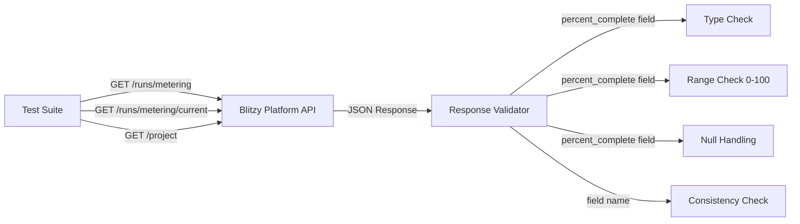

# Technical Specification

# 0. Agent Action Plan

## 0.1 Intent Clarification


### 0.1.1 Core Feature Objective

Based on the prompt, the Blitzy platform understands that the new feature requirement is to **create a comprehensive API test suite** that validates the presence, correctness, and schema compliance of a newly added `percent_complete` (or `percentComplete`) field across three existing API endpoints related to code generation project runs and metering data.

The specific requirements are:

- **API Response Field Verification**: Verify that three existing Blitzy Platform API endpoints now include a new progress percentage field (`percent_complete` or `percentComplete`) in their JSON response payloads
- **Endpoint Coverage**: The test suite must cover all three target endpoints:
  - `GET /runs/metering` — Returns metering data for multiple code generation runs (triggered when viewing run history or fetching metering data)
  - `GET /runs/metering/current` — Returns metering data for a currently in-progress run (triggered during live run status polling or auto-refresh)
  - `GET /project` — Returns project data with inline metering information embedded in the response (triggered when opening a project page)
- **Value Domain Validation**: The `percent_complete` / `percentComplete` field must conform to a strict value domain:
  - Numeric value between `0.0` and `100.0` (inclusive) for active or completed runs
  - `null` when metering data is not applicable
  - The field must never be missing from the response (absence constitutes a bug)
- **Edge Case Detection**: The test suite must detect and flag invalid states:
  - Values exceeding `100` or below `0`
  - Incorrect data types (e.g., string instead of number)
  - Field name inconsistency (`percent_complete` vs `percentComplete`) across endpoints
  - Field present in some endpoints but missing in others
- **Scenario-Based Testing**: Tests must cover multiple run states:
  - Completed runs (expected value between 0–100)
  - In-progress runs (expected value likely less than 100)
  - Runs with no applicable data (expected value: `null`)

**Implicit requirements detected:**

- The test framework must be runnable in both local development and CI/CD environments
- Test assertions must provide clear, actionable error messages distinguishing between missing fields, wrong types, and out-of-range values
- The test suite must support configurable base URLs and authentication to target different environments (staging, production)
- Tests should be idempotent and not modify server state (read-only GET verification)

### 0.1.2 Special Instructions and Constraints

- **Read-Only Verification**: All tests are strictly GET-based verifications of existing API responses — no data mutation or write operations
- **Field Name Flexibility**: The implementation must accommodate both `percent_complete` (snake_case) and `percentComplete` (camelCase) naming conventions, but flag inconsistency across endpoints as a potential issue
- **Context-Dependent API Availability**: The APIs are not always called automatically — they are triggered by specific user actions (opening a project, starting a run, viewing run history), meaning tests must simulate or trigger the appropriate context
- **Repository Convention**: The repository (`5th-April-Bug-Fixing-project`) is currently empty (contains only `README.md`), so all project structure, dependencies, and test files must be created from scratch
- **Blitzy Platform Ecosystem**: This project operates within the Blitzy Platform ecosystem, which uses Python 3.12 as its primary runtime, as documented in the system's technology stack

### 0.1.3 Technical Interpretation

These feature requirements translate to the following technical implementation strategy:

- To **validate the percent_complete field across all three endpoints**, we will create a Python-based test suite using `pytest` with parameterized test cases that issue HTTP GET requests to each endpoint and assert the response schema
- To **handle field name flexibility**, we will implement a utility function that checks for both `percent_complete` and `percentComplete` keys in the response JSON and normalizes the field name for assertion purposes
- To **cover all run states** (completed, in-progress, no data), we will create scenario-based test classes organized by endpoint, each with test methods for the different expected states
- To **detect edge cases**, we will implement strict type-checking assertions that validate the field is either a numeric value within `[0.0, 100.0]` or explicitly `null`, rejecting strings, booleans, negative numbers, and values exceeding 100
- To **support environment flexibility**, we will use a configuration module that reads base URL and authentication parameters from environment variables or a configuration file
- To **ensure consistency across endpoints**, we will create a cross-endpoint consistency test that verifies the field name convention is uniform across all three API responses


## 0.2 Repository Scope Discovery


### 0.2.1 Comprehensive File Analysis

#### Current Repository State

The repository (`5th-April-Bug-Fixing-project`) is currently empty — containing only a single file at the root level:

| File | Status | Content |
|------|--------|---------|
| `README.md` | EXISTING | Contains only the heading `# 5th-April-Bug-Fixing-project` |

There are no source code directories, dependency manifests, configuration files, test folders, CI/CD descriptors, container definitions, or lock files present. The repository is a greenfield environment requiring full project scaffolding.

#### Existing Files to Modify

| File Path | Modification Purpose |
|-----------|---------------------|
| `README.md` | Update with project description, setup instructions, usage guide, and test execution documentation |

#### Integration Point Discovery

The three target API endpoints that the test suite must validate are part of the broader Blitzy Platform, not this repository. The integration points are:

- **`GET /runs/metering?projectId=xxx`** — Metering data endpoint for multiple code generation runs; returns array-based response with per-run metering objects
- **`GET /runs/metering/current`** — Current run metering endpoint; returns metering data for the actively running code generation process; typically invoked via polling
- **`GET /project?id=xxx`** — Project detail endpoint with embedded inline metering information; returns a project object that nests metering data within the response body

#### New Source Files to Create

- `src/__init__.py` — Package initializer for the source module
- `src/config.py` — Centralized configuration for API base URL, authentication credentials, and environment-specific settings
- `src/api_client.py` — HTTP client wrapper for making authenticated GET requests to the Blitzy Platform APIs
- `src/validators.py` — Validation utilities for `percent_complete` field type checking, range verification, and field name normalization
- `src/models.py` — Data models representing expected API response schemas for metering and project endpoints

#### New Test Files to Create

- `tests/__init__.py` — Package initializer for the test module
- `tests/conftest.py` — Shared pytest fixtures for API client initialization, authentication, and test data setup
- `tests/test_runs_metering.py` — Test suite for `GET /runs/metering` endpoint validating `percent_complete` field presence, type, and value range across multiple run records
- `tests/test_runs_metering_current.py` — Test suite for `GET /runs/metering/current` endpoint validating the field for in-progress runs
- `tests/test_project_inline_metering.py` — Test suite for `GET /project` endpoint validating the embedded metering data with `percent_complete` field
- `tests/test_cross_endpoint_consistency.py` — Cross-cutting test that validates field name consistency (`percent_complete` vs `percentComplete`) and schema uniformity across all three endpoints
- `tests/test_edge_cases.py` — Dedicated edge case tests for out-of-range values, wrong data types, null handling, and field absence detection

#### New Configuration Files to Create

- `requirements.txt` — Python dependency declarations for pytest, requests/httpx, and supporting libraries
- `pytest.ini` — Pytest configuration with test discovery paths, markers, and output settings
- `.env.example` — Template for environment variables (API base URL, authentication tokens)
- `.gitignore` — Standard Python gitignore for virtual environment, cache, and IDE files

### 0.2.2 Web Search Research Conducted

Given the nature of this feature — API response validation testing — the following research areas are relevant:

- Best practices for REST API response schema validation with pytest
- Python libraries for JSON schema validation (jsonschema, pydantic)
- Parameterized testing patterns for multi-endpoint API verification
- HTTP client library comparison (requests vs httpx) for test suites

### 0.2.3 New File Requirements

**New source files to create:**

- `src/config.py` — Environment-aware configuration loading for API base URLs and authentication credentials; supports `.env` files and direct environment variable injection
- `src/api_client.py` — Lightweight HTTP client abstraction encapsulating authenticated GET requests with retry logic, timeout handling, and response parsing
- `src/validators.py` — Core validation logic for `percent_complete` field: type assertion (int/float/None), range checking ([0.0, 100.0]), field name detection (snake_case and camelCase), and error message generation
- `src/models.py` — Pydantic-based response models defining the expected structure of metering and project API responses, including the `percent_complete` field with its type constraints

**New test files to create:**

- `tests/conftest.py` — Shared fixtures providing configured API client instances, sample project IDs, and parametrized test data for different run states
- `tests/test_runs_metering.py` — Validates `GET /runs/metering` responses for completed and historical runs
- `tests/test_runs_metering_current.py` — Validates `GET /runs/metering/current` responses for in-progress runs with polling behavior
- `tests/test_project_inline_metering.py` — Validates `GET /project` responses with nested metering data
- `tests/test_cross_endpoint_consistency.py` — Ensures uniform field naming and schema across all three endpoints
- `tests/test_edge_cases.py` — Boundary and negative tests for field value validation

**New configuration files:**

- `requirements.txt` — Dependency manifest with pinned versions
- `pytest.ini` — Test runner configuration
- `.env.example` — Environment variable template with documented variables
- `.gitignore` — Standard exclusion patterns for Python projects


## 0.3 Dependency Inventory


### 0.3.1 Private and Public Packages

Since the repository is currently empty, all dependencies must be added fresh. The following packages are required to build the API test suite for the `percent_complete` field validation feature:

| Package Registry | Package Name | Version | Purpose |
|-----------------|--------------|---------|---------|
| PyPI (public) | `pytest` | 9.0.2 | Test framework for organizing, discovering, and executing test cases with rich assertion introspection |
| PyPI (public) | `httpx` | 0.28.1 | Modern HTTP client library for making authenticated GET requests to the Blitzy Platform APIs; supports sync and async APIs |
| PyPI (public) | `pydantic` | 2.12.5 | Data validation library for defining expected API response schemas with strict type enforcement |
| PyPI (public) | `python-dotenv` | 1.2.2 | Environment variable loading from `.env` files for API base URLs and authentication tokens |
| PyPI (public) | `pytest-cov` | 7.1.0 | Test coverage reporting plugin for pytest to measure test suite completeness |

**Runtime**: Python 3.12 (aligned with the Blitzy Platform's documented runtime as specified in the technology stack)

### 0.3.2 Dependency Updates

Since the repository is empty and this is a greenfield project, there are no existing dependencies to update, transform, or migrate. All dependencies listed above represent new additions.

#### Import Patterns

All new source files will follow standard Python import conventions:

- `src/**/*.py` — Internal imports using relative paths within the `src` package
- `tests/**/*.py` — Test imports referencing `src` modules and pytest fixtures
- All external library imports (`httpx`, `pydantic`, `pytest`) use standard PyPI package names

#### External Reference Updates

- `requirements.txt` — New file containing all pinned dependency declarations
- `pytest.ini` — New pytest configuration file
- `.env.example` — New environment variable template
- `README.md` — Existing file to be updated with project setup and dependency installation instructions


## 0.4 Integration Analysis


### 0.4.1 Existing Code Touchpoints

The repository currently contains only `README.md`. Since this is a greenfield test suite project, the integration analysis focuses on the **external Blitzy Platform APIs** that the test suite must connect to, rather than internal codebase modifications.

#### Direct Modifications Required

| File Path | Modification Type | Purpose |
|-----------|------------------|---------|
| `README.md` | MODIFY | Update with project description, setup instructions, dependency installation guide, environment variable configuration, and test execution documentation |

#### External API Integration Points

The test suite must integrate with three Blitzy Platform API endpoints hosted externally. These endpoints are not part of this repository — they are consumed as test targets:

- **`GET /runs/metering?projectId=xxx`**
  - Triggered by: Viewing run history, fetching metering data for multiple runs
  - Expected response: Array of metering objects, each containing a `percent_complete` or `percentComplete` field
  - Authentication: Requires valid Blitzy Platform bearer token
  - Query parameter: `projectId` (required) — identifies the target project

- **`GET /runs/metering/current`**
  - Triggered by: Viewing live run status, auto-refresh polling during active code generation
  - Expected response: Single metering object for the currently in-progress run, containing `percent_complete` or `percentComplete`
  - Authentication: Requires valid Blitzy Platform bearer token
  - Availability: Only returns data when a run is actively in progress

- **`GET /project?id=xxx`**
  - Triggered by: Opening a project page in the Blitzy Platform UI
  - Expected response: Project detail object with inline metering data embedded, containing `percent_complete` or `percentComplete` within the nested metering structure
  - Authentication: Requires valid Blitzy Platform bearer token
  - Query parameter: `id` (required) — identifies the target project

### 0.4.2 Service Dependencies and Wiring

#### Configuration Injection Points

- **`src/config.py`** (CREATE) — Centralized configuration module that reads the following from environment variables or `.env` file:
  - `API_BASE_URL` — Base URL of the Blitzy Platform API (e.g., `https://api.blitzy.com`)
  - `API_AUTH_TOKEN` — Bearer token for authenticating API requests
  - `PROJECT_ID` — Default project ID for test targeting
  - `REQUEST_TIMEOUT` — HTTP request timeout in seconds (default: 30)

- **`tests/conftest.py`** (CREATE) — Shared pytest fixtures wiring the configuration into test execution:
  - `api_client` fixture: Returns a configured `httpx.Client` instance with base URL and auth headers
  - `project_id` fixture: Provides the target project ID from configuration
  - `metering_response` fixture: Fetches and caches the `/runs/metering` response for reuse
  - `current_metering_response` fixture: Fetches the `/runs/metering/current` response
  - `project_response` fixture: Fetches and caches the `/project` response

#### Cross-Endpoint Consistency Integration

- **`tests/test_cross_endpoint_consistency.py`** (CREATE) — Validates that the `percent_complete` field naming convention is consistent across all three endpoints; detects mismatches where one endpoint uses `percent_complete` and another uses `percentComplete`

### 0.4.3 Data Flow Architecture

The test suite operates as a read-only consumer of the Blitzy Platform APIs. No database, schema, or migration changes are required within this repository.




## 0.5 Technical Implementation


### 0.5.1 File-by-File Execution Plan

Every file listed below MUST be created or modified as part of this feature implementation.

#### Group 1 — Core Source Files

- **CREATE: `src/__init__.py`** — Package initializer for the source module; enables Python package discovery
- **CREATE: `src/config.py`** — Configuration management using Pydantic `BaseSettings` to load API base URL, authentication token, project ID, and request timeout from environment variables or `.env` files
- **CREATE: `src/api_client.py`** — HTTP client wrapper using `httpx.Client` that provides authenticated GET methods for all three target endpoints with configurable timeout, retry behavior, and structured error handling
- **CREATE: `src/validators.py`** — Core validation logic containing:
  - `find_percent_field(data)` — Detects and normalizes `percent_complete` / `percentComplete` from response JSON
  - `validate_percent_value(value)` — Asserts the value is `float | int | None` within `[0.0, 100.0]`
  - `check_field_consistency(responses)` — Compares field naming across multiple endpoint responses
- **CREATE: `src/models.py`** — Pydantic response models defining expected API response schemas:
  - `MeteringRecord` — Schema for individual run metering data with `percent_complete` field
  - `MeteringResponse` — Schema for the `/runs/metering` array response
  - `CurrentMeteringResponse` — Schema for the `/runs/metering/current` single-object response
  - `ProjectResponse` — Schema for the `/project` response with nested inline metering data

#### Group 2 — Test Files

- **CREATE: `tests/__init__.py`** — Package initializer for test module
- **CREATE: `tests/conftest.py`** — Shared pytest fixtures:
  - `api_client` — Configured httpx client with auth headers and base URL
  - `project_id` — Target project identifier loaded from configuration
  - Endpoint-specific response fixtures with session-scoped caching
- **CREATE: `tests/test_runs_metering.py`** — Test suite for `GET /runs/metering`:
  - `test_percent_complete_field_present` — Asserts field exists in every record
  - `test_percent_complete_type` — Validates numeric or null type
  - `test_percent_complete_range` — Asserts values within [0.0, 100.0]
  - `test_completed_run_value` — Verifies completed runs have values between 0–100
- **CREATE: `tests/test_runs_metering_current.py`** — Test suite for `GET /runs/metering/current`:
  - `test_current_percent_complete_present` — Asserts field exists for active run
  - `test_current_percent_complete_type` — Validates numeric or null type
  - `test_in_progress_value_under_100` — Asserts in-progress runs have values less than 100
- **CREATE: `tests/test_project_inline_metering.py`** — Test suite for `GET /project`:
  - `test_project_has_metering_data` — Asserts metering section exists in project response
  - `test_project_percent_complete_present` — Asserts field exists within nested metering
  - `test_project_percent_complete_valid` — Validates type and range of nested field
- **CREATE: `tests/test_cross_endpoint_consistency.py`** — Cross-endpoint validation:
  - `test_field_name_consistency` — Ensures same naming convention across all three endpoints
  - `test_schema_uniformity` — Validates the field type is consistent across endpoints
- **CREATE: `tests/test_edge_cases.py`** — Edge case and boundary tests:
  - `test_value_not_exceeding_100` — Rejects values > 100
  - `test_value_not_below_zero` — Rejects values < 0
  - `test_value_not_string` — Rejects string data types
  - `test_null_is_acceptable` — Confirms `null` is a valid value
  - `test_field_not_missing` — Flags absent field as a bug

#### Group 3 — Configuration and Documentation

- **CREATE: `requirements.txt`** — Pinned dependency declarations:
  ```
  pytest==9.0.2
  httpx==0.28.1
  ```
- **CREATE: `pytest.ini`** — Pytest configuration with test paths, markers, and verbosity settings
- **CREATE: `.env.example`** — Environment variable template documenting required configuration
- **CREATE: `.gitignore`** — Standard Python exclusion patterns for `__pycache__`, `.env`, `venv/`, `.pytest_cache/`
- **MODIFY: `README.md`** — Updated with project overview, setup instructions, environment configuration, and test execution guide

### 0.5.2 Implementation Approach per File

- **Establish the configuration foundation** by creating `src/config.py` with Pydantic `BaseSettings` to load environment-specific API connection details, then `src/api_client.py` to provide authenticated HTTP GET methods
- **Build the validation layer** in `src/validators.py` with field detection (handling both snake_case and camelCase), type checking, range validation, and cross-endpoint consistency checking
- **Define response models** in `src/models.py` using Pydantic `BaseModel` classes that enforce the expected structure of each API response including optional `percent_complete` fields
- **Implement endpoint-specific test suites** in `tests/test_runs_metering.py`, `tests/test_runs_metering_current.py`, and `tests/test_project_inline_metering.py` using parameterized test cases that exercise different run states (completed, in-progress, no data)
- **Create cross-cutting tests** in `tests/test_cross_endpoint_consistency.py` to ensure field naming and typing are uniform across all three endpoints
- **Add boundary tests** in `tests/test_edge_cases.py` to detect invalid states including out-of-range values, wrong types, and missing fields
- **Document everything** by updating `README.md` with comprehensive setup and usage instructions

### 0.5.3 User Interface Design

This feature has no user interface component. The test suite is executed via the command line using `pytest` and produces terminal output and optional coverage reports. The user interacts with the Blitzy Platform web UI to trigger the API calls being validated, but the test suite itself is a CLI-based tool.

Validation of the API responses is performed programmatically — the user's manual browser DevTools inspection approach (Network tab → XHR filter → search for `metering`, `runs`, `project`) described in the requirements is automated by the test suite to eliminate manual verification steps.


## 0.6 Scope Boundaries


### 0.6.1 Exhaustively In Scope

**All feature source files:**

- `src/__init__.py` — Package initializer
- `src/config.py` — Configuration management module
- `src/api_client.py` — HTTP client wrapper for API interactions
- `src/validators.py` — Field validation and consistency checking utilities
- `src/models.py` — Pydantic response schema models

**All feature test files:**

- `tests/__init__.py` — Test package initializer
- `tests/conftest.py` — Shared pytest fixtures and configuration
- `tests/test_runs_metering.py` — Tests for `GET /runs/metering` endpoint
- `tests/test_runs_metering_current.py` — Tests for `GET /runs/metering/current` endpoint
- `tests/test_project_inline_metering.py` — Tests for `GET /project` inline metering
- `tests/test_cross_endpoint_consistency.py` — Cross-endpoint field consistency tests
- `tests/test_edge_cases.py` — Boundary and negative test cases

**Integration points (external API targets):**

- `GET /runs/metering?projectId=xxx` — Metering data for multiple runs
- `GET /runs/metering/current` — Current in-progress run metering data
- `GET /project?id=xxx` — Project detail with inline metering data

**Configuration files:**

- `requirements.txt` — Dependency manifest with pinned versions
- `pytest.ini` — Pytest runner configuration
- `.env.example` — Environment variable documentation template
- `.gitignore` — Version control exclusion patterns

**Documentation:**

- `README.md` — Project overview, setup, configuration, and usage documentation

**Validation domains:**

- Field presence — `percent_complete` or `percentComplete` must exist in every response
- Type validation — Field value must be `float`, `int`, or `null`
- Range validation — Numeric values must be within `[0.0, 100.0]`
- Naming consistency — Field naming convention must be uniform across all three endpoints
- Scenario coverage — Completed runs, in-progress runs, and no-data states

### 0.6.2 Explicitly Out of Scope

- **Blitzy Platform API source code** — The three target endpoints are external to this repository; their implementation is not modified or inspected
- **API mutation or write operations** — The test suite performs only GET requests; no POST, PUT, DELETE, or PATCH operations are included
- **Authentication system implementation** — Auth tokens are provided via configuration; the test suite does not implement login flows or token refresh
- **Performance testing or load testing** — No stress testing, benchmarking, or concurrent request validation is planned
- **Reverse Document Generator worker** — The event-driven microservice documented in the tech spec is unrelated to the API test suite being built
- **UI/frontend testing** — Although the user's requirements describe manual browser DevTools inspection, the test suite automates this programmatically; no Selenium, Playwright, or browser automation is included
- **Database changes, migrations, or schema modifications** — No data persistence layer exists in this repository
- **CI/CD pipeline setup** — While the test suite supports CI execution, pipeline configuration files (GitHub Actions, GitLab CI) are not in scope for this initial implementation
- **Other API endpoints** — Only the three specified endpoints are tested; other Blitzy Platform APIs are excluded
- **Refactoring existing platform code** — No changes to any external service or upstream code


## 0.7 Rules for Feature Addition


### 0.7.1 Feature-Specific Rules and Requirements

The following rules are derived from the user's explicit requirements and must be strictly observed during implementation:

- **Field Name Flexibility**: The test suite must check for both `percent_complete` (snake_case) and `percentComplete` (camelCase) field names in API responses. The presence of either naming convention is acceptable, but inconsistency across endpoints must be flagged as a potential issue

- **Value Domain Enforcement**: The `percent_complete` field must satisfy one of exactly two valid states:
  - A numeric value (`int` or `float`) within the inclusive range `[0.0, 100.0]`
  - Explicitly `null` (when not applicable)
  - Any other state — missing field, string type, boolean type, value > 100, value < 0 — constitutes a bug

- **Mandatory Field Presence**: The absence of the `percent_complete` / `percentComplete` field from any of the three endpoint responses is explicitly a bug. The field must always be present, even if its value is `null`

- **Scenario Coverage Matrix**: Tests must validate all three documented run states per the user's requirements:

  | Scenario | Expected Value | Endpoint Applicability |
  |----------|---------------|----------------------|
  | Completed run | Numeric value between 0–100 | All three endpoints |
  | In-progress run | Numeric value likely < 100 | Primarily `/runs/metering/current` |
  | No applicable data | `null` | All three endpoints |

- **Read-Only Execution**: All tests must be strictly read-only GET requests. The test suite must never modify server state, create resources, or trigger side effects on the Blitzy Platform

- **Environment Configurability**: The test suite must be executable against different environments (development, staging, production) by changing environment variables only — no code changes required to switch targets

- **Cross-Endpoint Uniformity**: If a field name mismatch is detected (e.g., `percent_complete` in one endpoint and `percentComplete` in another), the test suite must report this clearly with a descriptive assertion message identifying which endpoints are inconsistent

- **Idempotent Test Execution**: Running the test suite multiple times must produce the same results given the same API state. Tests must not depend on execution order or shared mutable state


## 0.8 References


### 0.8.1 Repository Files and Folders Searched

The following files and folders were searched across the codebase to derive the conclusions in this Agent Action Plan:

| Path | Type | Outcome |
|------|------|---------|
| `/` (repository root) | Folder | Contains only `README.md`; confirmed empty repository with no source code, dependencies, or configuration |
| `README.md` | File | Single line: `# 5th-April-Bug-Fixing-project`; no project description, setup instructions, or documentation |
| `/tmp/environments_files/` | Folder | Empty; no user-provided environment files found |
| System-wide `.blitzyignore` search | Search | No `.blitzyignore` files found anywhere in the filesystem |

### 0.8.2 Technical Specification Sections Retrieved

The following sections from the existing Technical Specification document were retrieved and analyzed to understand the Blitzy Platform ecosystem context:

| Section | Key Insight |
|---------|-------------|
| 1.1 Executive Summary | System is an automated Technical Specification document generation microservice within the Blitzy Platform ecosystem |
| 1.2 System Overview | Two operational modes (GENERATE/UPDATE), four specialized LLM agents, LangGraph StateGraph orchestration |
| 1.3 Scope | Confirmed REST API endpoints and user-facing web interfaces are explicitly out of scope for the document generator service |
| 1.4 Technology Stack Summary | Python 3.12 on Ubuntu 24.04, Docker containerized, single dependency blitzy-platform-shared==0.0.730 |
| 2.1 Feature Catalog | 18 features across 6 categories, all marked completed |
| 2.2 Functional Requirements | Detailed requirements tables for all features including event payload validation and Pub/Sub notifications |
| 3.2 Frameworks & Libraries | LangGraph, LangChain Core, Pydantic V2, GCP libraries, thefuzz, HuggingFace Transformers |
| 3.3 Open Source Dependencies | Single direct dependency (blitzy-platform-shared==0.0.730) from private Google Artifact Registry |
| 6.1 Core Services Architecture | Event-driven, containerized, single-worker Cloud Run Job; no HTTP endpoints exposed; three-tier error handling |
| 6.2 Database Design | No traditional relational database; four-component data persistence (Neo4j, GCS, Pub/Sub, in-memory) |
| 6.3 Integration Architecture | System does NOT expose an HTTP API; integrates with 12 external services; all endpoints configured via environment variables |
| 6.6 Testing Strategy | Deliberately minimal testing posture; only 2 script-based integration tests; no unit test framework configured |

### 0.8.3 External Research Conducted

| Research Topic | Source | Finding |
|---------------|--------|---------|
| pytest latest stable version | PyPI (pypi.org/project/pytest) | Version 9.0.2 confirmed as latest stable release |
| httpx latest stable version | PyPI (pypi.org/project/httpx) | Version 0.28.1 confirmed as latest stable release |
| pydantic latest stable version | PyPI (pypi.org/project/pydantic) | Version 2.12.5 confirmed as latest stable release (2.13.0 is beta) |
| python-dotenv latest version | PyPI (pypistats.org) | Version 1.2.2 confirmed as latest stable release |
| pytest-cov latest version | pytest-cov documentation | Version 7.1.0 confirmed as latest stable release |

### 0.8.4 Attachments and User-Provided Resources

No file attachments were provided by the user. No Figma URLs or design files were referenced.

The user's input consisted of a structured markdown document describing the API validation requirements, including endpoint specifications, expected field behavior, edge cases, and a manual browser-based testing procedure that this test suite automates.


